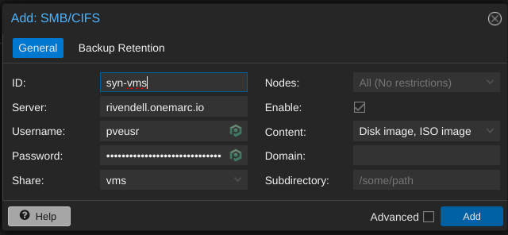
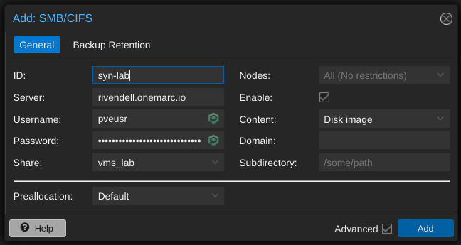
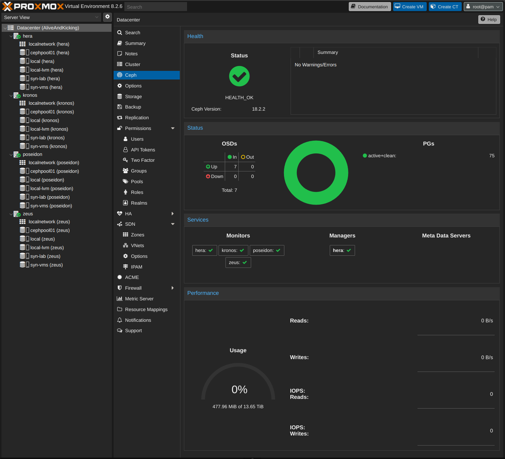

# My HomeLab

Install 4 nodes with latest version of Proxmox Virtual Environment (PVE).

## Storage setup

This is the table of the storage of each PVE for installation.

|  param   | GB         | GB       | GB       | GB           |
| -------- | ---------- | -------- | -------- | ------------ |
| hdsize   | 465        | 931      | 953      | 931          |
| swapsize | 64         | 64       | 64       | 64           |
| maxroot  | 100        | 100      | 100      | 100          |
| minfree  | 64         | 64       | 64       | 64           |
| maxvz    | 237        | 703      | 725      | 703          |
|          | **kronos** | **zeus** | **hera** | **poseidon** |

## Create certificates

Resources: <https://www.youtube.com/watch?v=MgLnvkX7tbM>

1. Generate the certificates following the steps in [certs > README](certs/README.md)
1. Copy them them `mpt4dev > roles > certs_hypervisor > files`

This certificates will be installed in each node when running the Ansible playbook.

To install on your machine:

### Install certificates (Linux)

```bash
cd .\certs
sudo cp onemarc-ca-cert.crt /usr/local/share/ca-certificates/extra
sudo cp onemarc-wildcard.crt /usr/local/share/ca-certificates/extra
sudo update-ca-certificates
```

### Install certificates (Windows)

Powershell with admin privileges

```ps
cd .\certs
certutil -f -addstore "ROOT" onemarc-ca-cert.crt
certutil -f -addstore "ROOT" onemarc-wildcard.crt
```

## Setup users and ssh-keys

Setup ssh keys for passwordless authentication.

```bash
ssh-copy-id -i ~/.ssh/onemarc_rsa root@hera.onemarc.io
ssh-copy-id -i ~/.ssh/support_rsa root@hera.onemarc.io
ssh-copy-id -i ~/.ssh/onemarc_rsa root@kronos.onemarc.io
ssh-copy-id -i ~/.ssh/support_rsa root@kronos.onemarc.io
ssh-copy-id -i ~/.ssh/onemarc_rsa root@poseidon.onemarc.io
ssh-copy-id -i ~/.ssh/support_rsa root@poseidon.onemarc.io
ssh-copy-id -i ~/.ssh/onemarc_rsa root@zeus.onemarc.io
ssh-copy-id -i ~/.ssh/support_rsa root@zeus.onemarc.io
```

After that we should be able to login like this:

```bash
ssh -i ~/.ssh/onemarc_rsa root@hera.onemarc.io
ssh -i ~/.ssh/onemarc_rsa root@kronos.onemarc.io
ssh -i ~/.ssh/onemarc_rsa root@poseidon.onemarc.io
ssh -i ~/.ssh/onemarc_rsa root@zeus.onemarc.io
```

### Create `ansiblebot` user for ansible usage

Login to each server and:

1. Ensure that `sudo` is installed:

    ```bash
    apt install sudo
    ```

1. First, create a new user with `useradd`:

    ```bash
    sudo useradd -m -d /home/ansiblebot -s /bin/bash ansiblebot
    ```

1. Next, set the user’s password:

    ```bash
    passwd ansiblebot
    ```

    **Note**: You'll need to setup password so you can copy the ssh-key later.

1. Then, create the user’s `.ssh` directory:

    ```bash
    mkdir /home/ansiblebot/.ssh
    ```

1. After that, set up the correct permissions for both the `.ssh` directory and the `authorized_keys` file:

    ```bash
    # Create empty file to set security
    touch /home/ansiblebot/.ssh/authorized_keys

    # ensure the directory ir owned by the new user
    chown -R ansiblebot:ansiblebot /home/ansiblebot/.ssh

    # make sure only the new user has permissions
    chmod 700 /home/ansiblebot/.ssh
    chmod 600 /home/ansiblebot/.ssh/authorized_keys
    ```

1. Last, if you want the new user to have sudo access, be sure to add them to the `sudo` group:

    ```bash
    sudo usermod -a -G sudo ansiblebot
    ```

1. Disable asking for sudo password for `ansiblebot` user:

    ```bash
    echo "ansiblebot ALL=(ALL:ALL) NOPASSWD: ALL" | sudo tee /etc/sudoers.d/ansiblebot
    ```

1. And copy the user’s public key into the `authorized_keys` file.

    ```bash
    ssh-copy-id -i ~/.ssh/support_rsa ansiblebot@[SERVER_FQDN]
    ```

Now you should be able to login with ssh on each server using `ssh-keys` wuth user `ansiblebot`:

```bash
ssh -i ~/.ssh/support_rsa ansiblebot@hera.onemarc.io
ssh -i ~/.ssh/support_rsa ansiblebot@kronos.onemarc.io
ssh -i ~/.ssh/support_rsa ansiblebot@poseidon.onemarc.io
ssh -i ~/.ssh/support_rsa ansiblebot@zeus.onemarc.io
```

## Run `servers` playbook

Using [mpt4dev](https://github.com/fmarcelinoPT/mpt4dev) run the playbook:

```bash
ansible-galaxy install -r inventory/hypervisors_requirements.yml --force && \
ansible-playbook -i inventory/hypervisors.yml default-tools.yml
```

## Setup storage

### NAS

1. Create user `pveusr` on NAS for storage mapping

1. Setup `vms` share:

    

1. Setup `lab` share:

    

### Create Ceph storage

Resources: <https://www.youtube.com/watch?v=-qk_P9SKYK4>

1. Install Ceph in all nodes
1. Create OSDs storage for every disk in every node
1. Create `cephpool01`
1. Create ceph monitor in every node
1. After this point every node should have a new storage called `cephpool01`
1. We are ready to go

Expected result:



### License

[](https://opensource.org/licenses/MIT)

### Author Information

This role was created at 2024 by [fmarcelinoPT](https://github.com/fmarcelinoPT). Feel free to customize or extend the role to fit your needs.
